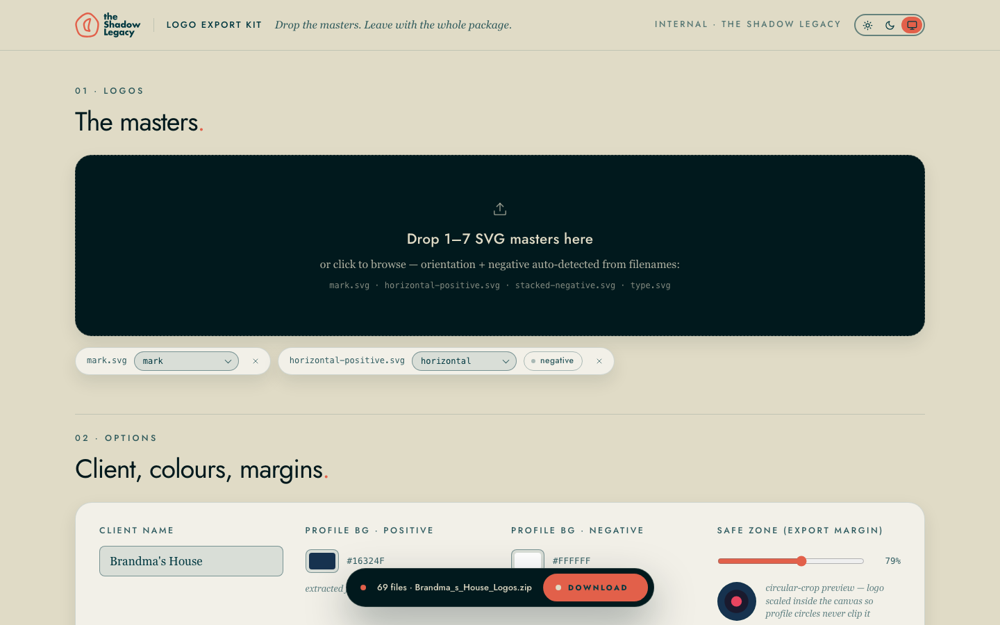
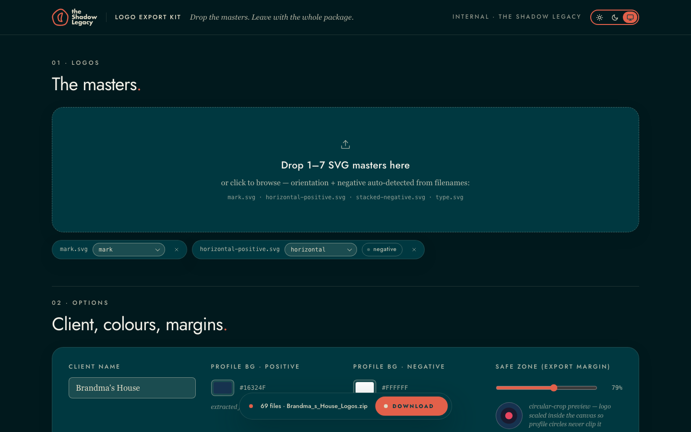

# Logo Export Kit

**Drop the SVG masters. Leave with the whole package.**

A browser tool by [The Shadow Legacy](https://theshadowlegacy.com) that turns 1–7 SVG logo masters into a complete, client-ready logo package — social profiles on brand-colour backgrounds (circle-safe), web sizes, a full favicon set (`.ico` included), print masters with **CMYK TIFF + JPEG** — every file named, filed and previewed, downloaded as one zip.

**Live:** https://logoexport.theshadowlegacy.com

<p>
  
  
</p>

## What it does

1. **Drop the masters** — orientation (mark · horizontal · stacked · type) and positive/negative are auto-detected from filenames (`mark.svg`, `horizontal-positive.svg`, `stacked-negative.svg`, `type.svg`); every detection is correctable in a chip.
2. **Set the options** — client name (drives every folder and filename), profile backgrounds (auto-extracted from the horizontal master, overridable), a **safe-zone** slider with a live circular-crop preview, and output toggles (B&W versions · social profiles · favicon · print · CMYK).
3. **Generate** — everything renders in your browser; the folder tree and a preview grid show the exact package; download the zip or any single file.

Light, dark and system themes (the switch in the header); the Download action follows you in the island once a package exists.

## How it works

- **Rendering is client-side.** Canvas in the visitor's browser — the same engine class as our CLI kit's headless-Chrome fallback — so output matches the CLI, previews are instant and the server does nothing for RGB.
- **CMYK is the one server piece** — `api/cmyk.py` (Vercel Python, Pillow-only) converts the browser-rendered 300 dpi print PNGs to CMYK TIFF + JPEG. Hosted conversion is profile-less (fine for flat logo colour; print shops re-profile anyway).
- `lib/dimensions.json` is the shared contract for every size and filename; `lib/engine.ts` holds detection, recolour and naming rules; `lib/render.ts` rasterises and zips (`fflate`).
- Plain Next.js (App Router) + React, no UI framework: `app/globals.css` carries the design tokens (light base, `.dark` swap), `components/` the theme switch, HoverButton, island and logo.

## Develop

```bash
npm install
npm run dev                               # http://localhost:4490 (api/cmyk.py needs `vercel dev` or a deployment)
npm run build && npm start
node qa/run-qa.mjs                        # QA gate: engine + themes, local (CMYK toggle off)
BASE=https://<deployment> CMYK=1 node qa/run-qa.mjs
node qa/contrast-check.mjs                # WCAG contrast gate for both themes (reads globals.css)
```

`qa/run-qa.mjs` uploads fixtures, generates, asserts the tree, zip contents and previews, then the light/dark/system contract; it writes `qa/out/qa-ui.png` (dark) and `qa/out/qa-ui-light.png`.

## Deploy

Vercel. `vercel deploy --prod` from a linked checkout, or push to `main` (the repo is connected). Python runtime picks up `requirements.txt` for `api/cmyk.py`.

## Design

Built to The Shadow Legacy's brand system: midnight `#003840` · moonmist `#E0DBC6` · sunrise `#E2604A` as the sole accent · Jost (Futura stand-in) display · Georgia body · 24 px cards, pill controls, the sunrise full-stop. Contrast and motion are gated (`qa/contrast-check.mjs`, reduced-motion respected throughout).

## License

MIT © 2026 The Shadow Legacy
